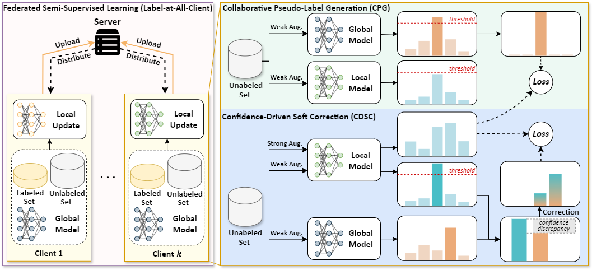

# SAGE

**Federated Semi-Supervised Learning via Pseudo-Correction Utilizing Confidence Discrepancy**



This is the repository of the CVPR 2025 paper: "Federated Semi-Supervised Learning via Pseudo-Correction Utilizing Confidence Discrepancy."

**Abstract:** Federated Semi-Supervised Learning (FSSL) aims to leverage unlabeled data across clients with limited labeled data to train a global model with strong generalization ability. Most FSSL methods rely on consistency regularization with pseudo-labels, converting predictions from local or global models into hard pseudo-labels as supervisory signals. However, we discover that the quality of pseudo-label is largely deteriorated by data heterogeneity, an intrinsic facet of federated learning. In this paper, we study the problem of FSSL in-depth and show that (1) heterogeneity exacerbates pseudo-label mismatches, further degrading model performance and convergence, and (2) local and global models' predictive tendencies diverge as heterogeneity increases. Motivated by these findings, we propose a simple and effective method called **S**emi-supervised **A**ggregation for **G**lobally-Enhanced **E** (SAGE), that can flexibly correct pseudo-labels based on confidence discrepancies. This strategy effectively mitigates performance degradation caused by incorrect pseudo-labels and enhances consensus between local and global models. Experimental results demonstrate that SAGE outperforms existing FSSL methods in both performance and convergence.

### Setup

1. Create a new Python environment:

   ```bash
   conda create --name sage python=3.8.18 
   conda activate sage
   ```

2. Install the required dependencies:

   ```bash
   pip install -r requirements.txt
   ```

### Dataset

Supported datasets:

* CIFAR-10
* CIFAR-100
* CINIC-10
* SVHN

Before running, please ensure the dataset paths are correctly set in `options.py`.

### Usage

Here is an example shell script to run SAGE on CIFAR-100 :

```bash
python SAGE.py --dataset='CIFAR100' --alpha=0.1 --gpu_id=0
```

Please replace `--dataset`, `--alpha`, and `--gpu_id` with appropriate values to customize the training configuration.


